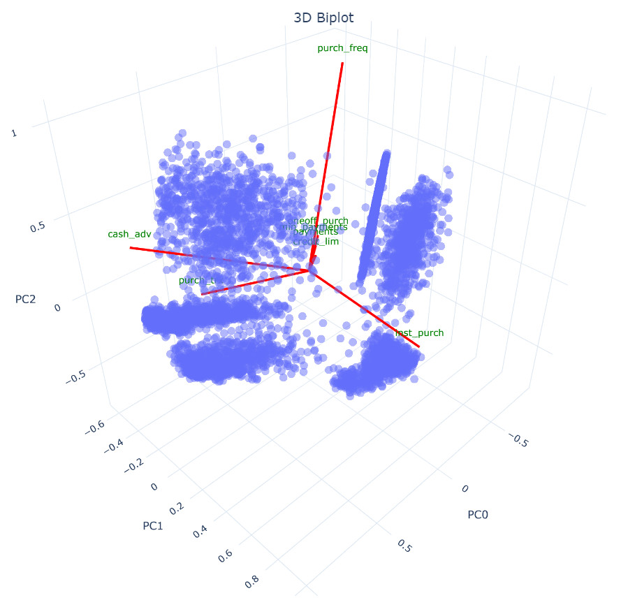

# Bank Customer Segmentation Methods

## Description

This project focuses on **Clustering Bank Customers** using various methods available in the **scikit-learn** library. My goal was to gain insights 
into the nature of clustering methods and learn how to use **scikit-learn** to implement these techniques in practical problems. A relevant 
business sector for this application is Finance and Banking, where understanding different customer segments is crucial for the survival 
of any institution providing financial services. This project was also created for a **Kaggle** challenge called **Credit Card Dataset for Clustering**.
The link to this event can be found in the repository description.

## Topics 
There are many techniques used in this notebook, but only a fraction of them are presented here. Please refer to the notebook to learn about all the 
techniques used.

**Principal Component Analysis (PCA)** <br>
<p float="left">

</p>

**Clustering methods**
- K-Means <br>
<p float="left">

</p>
- DBSCAN <br>
<p float="left">

</p>
- Agglomerative Clustering <br>
<p float="left">

</p>
- Affinity Propagation <br>
<p float="left">

</p>
- Spectral Clustering <br>
<p float="left">

</p>
- Gaussian Mixture Model <br>
<p float="left">

</p>

## Installation
To run this notebook, you'll need to have Jupyter Notebook and an Anaconda environment set up on your system.

#### 1. Clone the repository <br>
Open your terminal or command prompt and run: <br>
```bash
git clone https://github.com/vikaskheni/Bank_Customer_Segmentation.git
cd bank_customer_segmentation_methods
```
#### 2. Create and activate a new Anaconda environment <br>
```bash
conda create --name myenv python=3.8
conda activate myenv
```
#### 3. Install required packages <br>
```bash
pip install -r requirements.txt
```
#### 4. Launch Jupyter Notebook
```bash
jupyter notebook
```
#### 5. Navigate to the notebook and run it

## Technology stack
- Python programming language
- Jupyter Notebook

## Data source
- Kaggle: Your Machine Learning and Data Science Community https://www.kaggle.com/datasets/arjunbhasin2013/ccdata?resource=download
